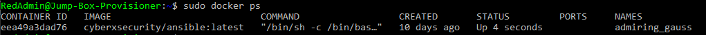

## Automated ELK Stack Deployment

The files in this repository were used to configure the network depicted below.

These files have been tested and used to generate a live ELK deployment on Azure. They can be used to either recreate the entire deployment pictured above. Alternatively, select portions of the *playbook* file may be used to install only certain pieces of it, such as Filebeat.

  - [Filebeat](Ansible/filebeat-playbook.yml)
  - [Metricbeat](Ansible/metricbeat-playbook.yml)

This document contains the following details:
- Description of the Topologu
- Access Policies
- ELK Configuration
  - Beats in Use
  - Machines Being Monitored
- How to Use the Ansible Build

### Description of the Topology

The main purpose of this network is to expose a load-balanced and monitored instance of DVWA, the D*mn Vulnerable Web Application.

Load balancing ensures that the application will be highly *available*, in addition to restricting *access* to the network.

- Load Balancing plays an important security role as computing moves evermore to the cloud. The off-loading function of a load balancer defends an organization against distributed denial-of-service (DDoS) attacks.
- A jump box is a secure computer that all admins first connect to before launching any administrative task or use as an origination point to connect to other servers or untrusted environments.

Integrating an ELK server allows users to easily monitor the vulnerable VMs for changes to the *log files* and system *resources*.
- Filebeat monitors the log files that you specify, collects log events, then displays them on Elasticsearch.
- Metricbeat gathers metrics ans system resource usage and displays in Elasticsearch. 

The configuration details of each machine may be found below.

| Name     | Function      | IP Address | Operating System |
|----------|---------------|------------|------------------|
| Jump Box | Gateway       | 10.0.0.4   | Linux            |
| Web1     | Web Server    | 10.0.0.5   | Linux            |
| Web2     | Web Server    | 10.0.0.6   | Linux            |
| ELK      | ElasticSearch | 10.1.0.4   | Linux            |

### Access Policies

The machines on the internal network are not exposed to the public Internet. 

Only the *Jumpbox* machine can accept connections from the Internet. Access to this machine is only allowed from the following IP addresses:
- *your IP*

Machines within the network can only be accessed by the *jumpbox*.
- Jumpbox 
  - Public IP - 23.99.82.70
  - Private IP - 10.0.0.4

A summary of the access policies in place can be found in the table below.

| Name          | Publicly Accessible | Allowed IP Address            |
|---------------|---------------------|-------------------------------|
| Jump Box      | No                  | Workstation Public IP -p 22   |
| Web1          | No                  | 10.0.0.4 -p 22                |
| Web2          | No                  | 10.0.0.4 -p 22                |
| Load Balancer | No                  | Workstation Public IP -p 80   |
| ELK           | No                  | Workstation Public IP -p 5601 |

### Elk Configuration

Ansible was used to automate configuration of the ELK machine. No configuration was performed manually, which is advantageous because...
- *it reduces errors when setting the configurations*

The playbook implements the following tasks:
- Install Docker - docker.io
- Install pip3 - python3-pip
- Increase Memory 
- Download and Launch Elk Container - specified ports

The following screenshot displays the result of running `docker ps` after successfully configuring the ELK instance.

### Target Machines & Beats
This ELK server is configured to monitor the following machines:
- 10.0.0.5
- 10.0.0.6

We have installed the following Beats on these machines:
- Filebeat and Metricbeat was installed on Web-1 and Web-2

These Beats allow us to collect the following information from each machine:
- Filebeat allows us to collect system events such as logins.
- Metricbeat allows us to collect metrics such as cpu and memory usage.

### Using the Playbook
In order to use the playbook, you will need to have an Ansible control node already configured. Assuming you have such a control node provisioned: 

SSH into the control node and follow the steps below:
- Copy the *elk.install.yml* file to */etc/ansible/elk_install.yml*.
- Update the *host* file to include...
  - 
- Run the playbook, and navigate to *http://[elk-server-ip]:5601/app/kibana* to check that the installation worked as expected.

- Copy install_elk.yml to /etc/ansible/install_elk.yml in your Jumpbox Ansible Container
- Run Playbook: ansible-playbook /etc/ansible/install_elk.yml
- Check to see *http://[elk-server-ip]:5601/app/kibana* is running.

